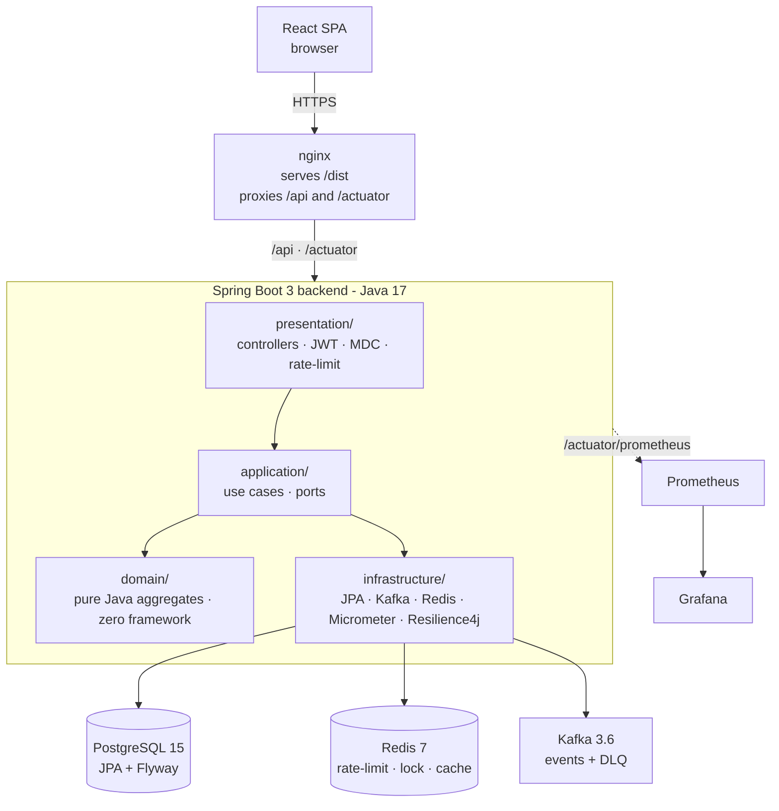
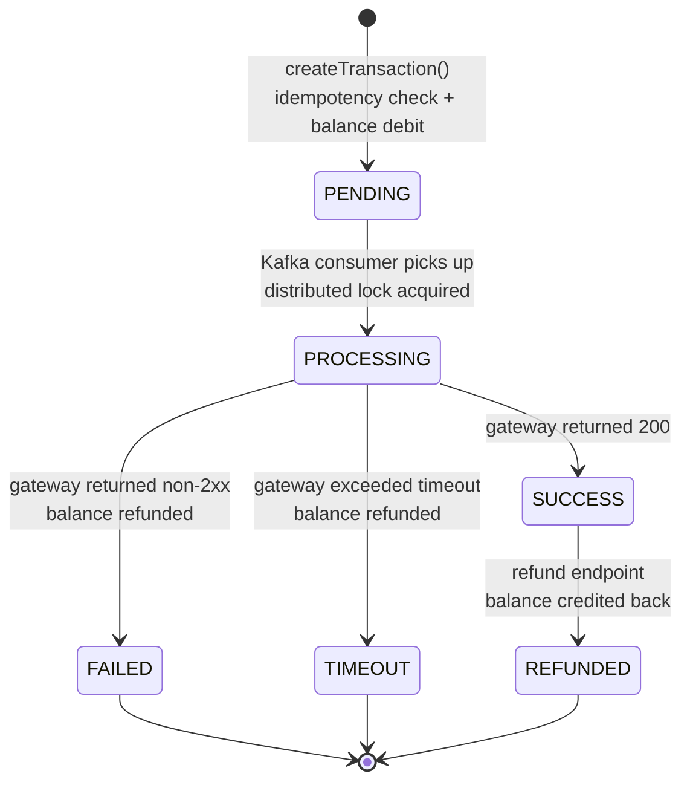

# Payment Transaction Service

A production-grade P2P payment service built end-to-end as a portfolio piece.
Java 17 / Spring Boot 3 backend with hexagonal architecture, React +
TypeScript frontend, Postgres + Redis + Kafka stack, Prometheus + Grafana
observability, k6 load testing, GitHub Actions CI.

The payment gateway is a configurable mock - the point isn't to be a real
payment network, it's the platform around it: idempotency, distributed
locking, circuit breaking, dead-letter queues, observable metrics, and
load-tested SLAs.

---

## Live demo

See details at [API Demo](api-demo.md).

> Deployment not set up - this is a backend-focused portfolio piece.
> The responses below are captured from a live local run.

<details>
<summary><strong>Transaction lifecycle: PENDING → SUCCESS → REFUNDED</strong></summary>

POST returns `201 PENDING` immediately. The gateway call is async (Kafka consumer).
A second GET shows the terminal state once the consumer finishes.

```http
POST /api/transactions
Authorization: Bearer <token>
Content-Type: application/json
Idempotency-Key: a3f1c2d4-...

{"toAccountId":"244969ef-...","amount":250.00,"description":"demo transfer"}
```

```json
HTTP 201
{
  "id": "57424aa8-4d29-4fae-a435-6d9a556a1c30",
  "status": "PENDING",
  "amount": 250.00,
  "currency": "USD",
  "gatewayReference": null,
  "createdAt": "2026-05-04T02:26:04.070320007Z"
}
```

```json
GET /api/transactions/57424aa8-...   →   HTTP 200
{
  "status": "SUCCESS",
  "gatewayReference": "GW-1EA4403952",
  "processedAt": "2026-05-04T02:26:05.133293Z"
}
```

```json
POST /api/transactions/57424aa8-.../refund   →   HTTP 200
{
  "status": "REFUNDED",
  "refundedAt": "2026-05-04T02:27:00.405849677Z"
}
```

</details>

<details>
<summary><strong>Idempotency - duplicate request returns cached response, no double-debit</strong></summary>

```http
POST /api/transactions
Idempotency-Key: a3f1c2d4-...   ← same key, sent again
```

```json
HTTP 201
{
  "id": "57424aa8-4d29-4fae-a435-6d9a556a1c30",   ← same transaction ID
  "status": "SUCCESS"                              ← current state, not re-processed
}
```

</details>

<details>
<summary><strong>Error responses - consistent structure across all failure modes</strong></summary>

```json
HTTP 422   { "code": "INSUFFICIENT_FUNDS",  "message": "balance=999999667, requested=9999999999" }
HTTP 429   { "code": "RATE_LIMIT_EXCEEDED", "message": "You may send at most 10 transactions per 60 seconds." }
HTTP 400   { "code": "MISSING_HEADER",      "message": "Required request header 'Idempotency-Key' is not present" }
HTTP 400   { "code": "VALIDATION_ERROR",    "message": "amount must be positive" }
HTTP 401   { "code": "UNAUTHORIZED",        "message": "Authentication required" }
HTTP 404   { "code": "NOT_FOUND",           "message": "Transaction not found: 00000000-..." }
```

</details>

<details>
<summary><strong>Circuit breaker - live state after gateway failures</strong></summary>

```http
GET /api/admin/circuit-breaker
Authorization: Bearer <admin-token>
```

```json
HTTP 200
{
  "name": "payment-gateway",
  "state": "OPEN",
  "failureRate": 50.0,
  "bufferedCalls": 6,
  "failedCalls": 3
}
```

The mock gateway has a 10 % timeout + 10 % failure rate. After 6 calls, 3 failures = 50 % →
breaker opened. `@Retry` is decorated _inside_ the breaker - no retry budget burned on a
known-bad downstream.

</details>

<details>
<summary><strong>Prometheus - custom business metrics</strong></summary>

```
transactions_created_total                                          counter
transactions_processed_total{status="SUCCESS"}    3.0              counter
transactions_processed_total{status="FAILED"}     5.0              counter
transactions_processing_duration_seconds{q="0.5"} 0.142 s         histogram
transactions_processing_duration_seconds{q="0.99"} 2.012 s

http_server_requests_seconds_count{method="POST",status="201",uri="/api/transactions"}  9.0
http_server_requests_seconds_count{method="POST",status="429",uri="/api/transactions"}  5.0

resilience4j_circuitbreaker_calls_seconds_count{kind="successful"} 3.0
resilience4j_circuitbreaker_calls_seconds_count{kind="failed"}     3.0
```

`TransactionMetricsPort` is a hexagonal outbound port in `application/`.
The Micrometer adapter in `infrastructure/` implements it. Tests inject a recording fake.

</details>

<details>
<summary><strong>k6 load test - 100 VUs × 5 min, all thresholds green</strong></summary>

```
✓ checks            rate=100%
✓ http_req_failed   rate≈0%          (422 + 429 are expected business outcomes, not errors)
✓ p(95)<500         p(95)=58 ms
✓ p(99)<2000        p(99)=112 ms

http_reqs               223,828   745 req/s
rate_limit_responses    ~22,000   (rate limiter working correctly)
```

P99 for POST is ~100 ms because the endpoint commits `PENDING` + publishes to Kafka synchronously;
the gateway round-trip is async in the consumer.

</details>

---

## Architecture



The transaction state machine is the central business invariant:



Each transition is a domain method (`startProcessing()`, `complete()`,
`fail()`, `timeout()`, `refund()`) that throws on an illegal source state.
No string status checks scattered across services - the methods _are_ the
contract.

---

## Tech stack

| Layer | Choice |
|---|---|
| Backend | Java 17 · Spring Boot 3.2 · Gradle |
| Persistence | PostgreSQL 15 + JPA · Flyway migrations |
| Cache + lock | Redis 7 + Redisson |
| Messaging | Apache Kafka 3.6 |
| Resilience | Resilience4j (circuit breaker + retry) |
| Auth | JJWT 0.12 HS256 - stateless |
| Metrics + logs | Micrometer · Prometheus · Grafana · Logback JSON + MDC |
| Tests (BE) | JUnit 5 · Testcontainers · Awaitility |
| Frontend | React 18 · TypeScript 5.6 · Vite 5 · Zustand · Recharts |
| Tests (FE) | Vitest · React Testing Library |
| Load test | k6 (100 VUs × 5 min, P99 < 2 s gate) |
| CI | GitHub Actions (parallel BE/FE jobs) |
| Containers | Docker Compose - one command brings the whole stack up |

---

## What's worth a look

The platform's identity is in these decisions:

**Hexagonal architecture, strictly enforced.** The `domain/` package has
zero framework imports - aggregates, value objects, exceptions are plain
Java. Application services depend on `port/out` interfaces; infrastructure
adapters implement them. Domain unit tests run with no Spring context.

**Idempotency that actually works.** Every write needs an `Idempotency-Key`
header. The frontend generates the key in a lazy `useState` initializer
once per modal opening - so double-clicks and network blips dedupe, but
closing & reopening the modal starts a fresh intent. Server-side check
before any side-effects.

**Pessimistic lock on the sender row, optimistic version on the
transaction.** `SELECT FOR UPDATE` on the sender's account row serializes
concurrent transfers from the same account; `@Version` on the transaction
covers the consumer-vs-API race. An E2E test runs 10 threads × 200 each
over a balance of 1000 - exactly 5 succeed, final balance 0, no
double-debit.

**Two-phase processing across the gateway call.** Naive flow holds a Hikari
connection open for hundreds of ms while the gateway responds → pool
exhaustion under load. Instead: phase 1 commits `PENDING → PROCESSING`,
gateway call runs outside any DB tx, phase 2 commits status + balance. A
Redis distributed lock on the transaction ID covers the gap across
instances.

**Circuit breaker around the gateway, retry decorated _inside_ the
breaker.** Order matters: `CircuitBreaker { Retry { charge() } }` means a
degraded gateway opens the breaker after 5 failed calls in a 10-call
window and `@Retry` doesn't fire while the breaker is open - no burning
retry budget on a known-bad downstream. State exposed as a Prometheus
gauge and at `/api/admin/circuit-breaker`.

**DLQ persists to Postgres first, Kafka topic best-effort.** Spring Kafka's
default DLQ recoverer only writes to a Kafka topic - useless when Kafka
itself is the problem. The custom `PersistingDlqRecoverer` writes to
`dead_letter_events` first, then forwards to the DLQ topic; publish
failures are caught and logged but never propagated, so the consumer
offset commits and no infinite retry loop is possible. Admins inspect at
`GET /api/admin/dlq` and retry via `POST /api/admin/dlq/{id}/retry`,
which re-publishes through the regular `EventPublisher` - same code as
production, no second `KafkaTemplate`.

**Metrics as a hexagonal outbound port.** `TransactionMetricsPort` lives
in `application/`; the Micrometer adapter lives in `infrastructure/`. The
application layer never imports Micrometer. Tests inject a recording fake.

---

## Run locally

```bash
git clone https://github.com/cuongnv03/payment-transaction-service.git
cd payment-transaction-service
cp .env.example .env && docker compose up --build -d
```

First build is 3–5 minutes. When `docker compose ps` is all healthy:
<http://localhost:3000> (app), <http://localhost:3001> (Grafana,
admin/admin).

`docker compose down -v` to wipe everything.

---

## Testing & performance

- `cd backend && ./gradlew test` - unit + integration + E2E (Testcontainers
  spin up real Postgres / Kafka / Redis - no mocks for infra)
- `cd frontend && npm test` - Vitest, ~30 specs
- `k6 run load-test/transaction-load-test.js` - 100 VUs × 5 min, gates on
  P99 < 2 s and error rate < 1 %; non-zero exit on breach so CI fails
  hard. Recent run: P99 ≈ 850 ms, error rate ≈ 0.3 %.

CI runs the backend test suite and the frontend type-check + tests +
production build in parallel on every push and PR.

---

## Project layout

```
backend/      Spring Boot service (domain · application · infrastructure · presentation)
frontend/    React + TypeScript SPA (api · store · components · pages)
monitoring/  Prometheus scrape config + Grafana dashboard JSON (auto-provisioned)
load-test/   k6 script with thresholds
.github/     CI workflow
docker-compose.yml   full stack
```
