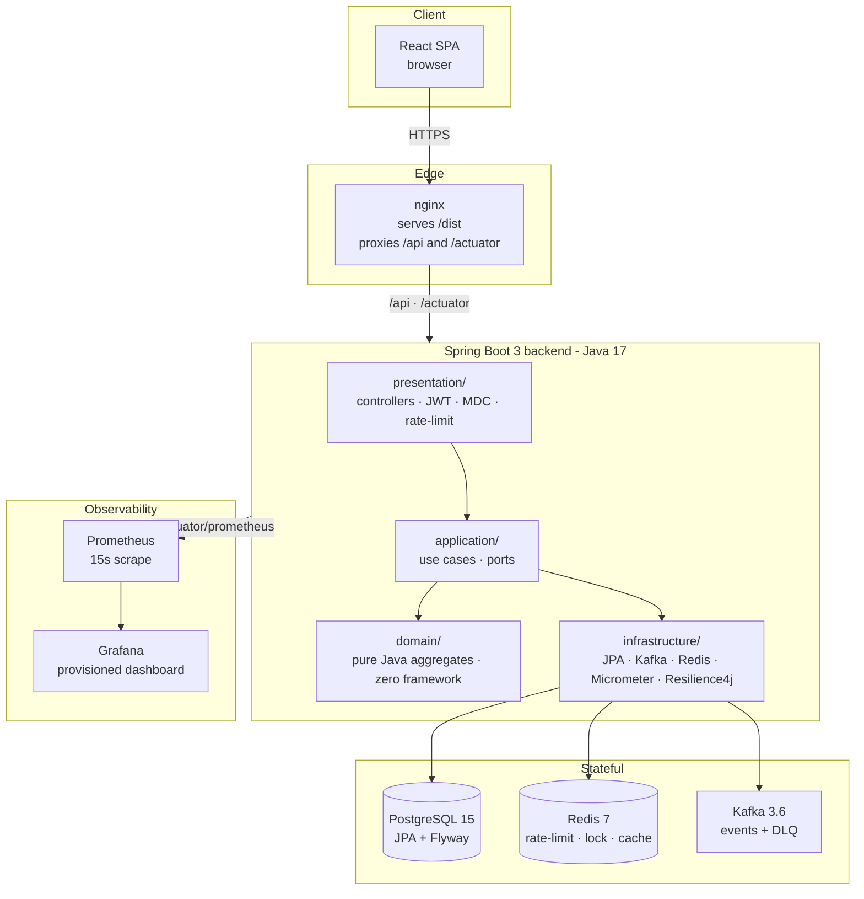
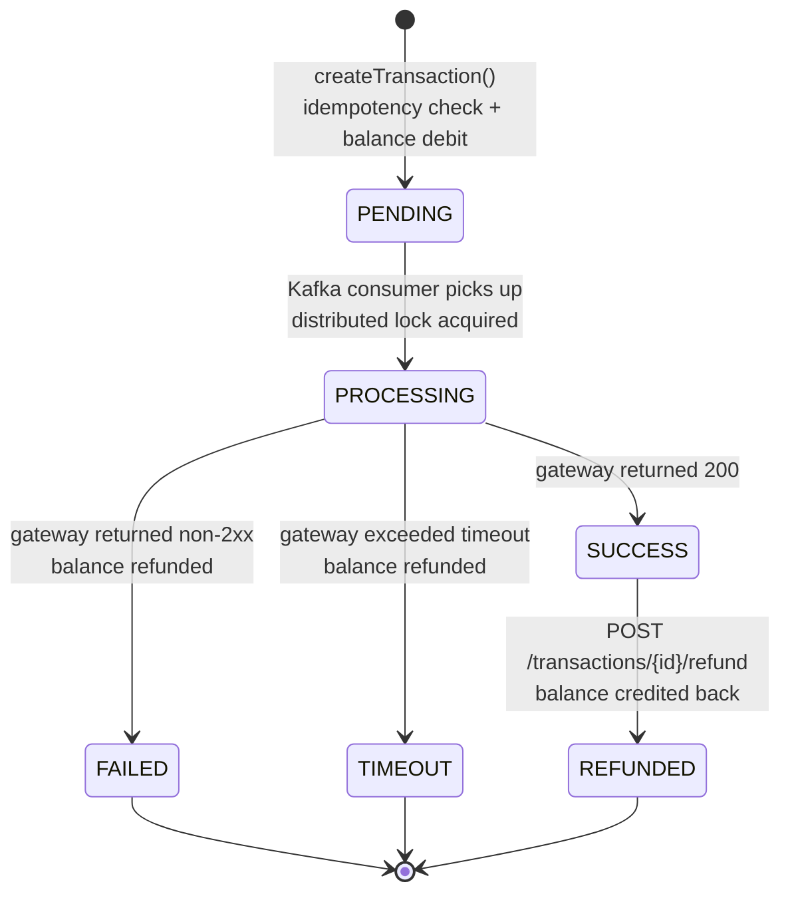

# Payment Transaction Service

A production-grade P2P payment service built end-to-end as a portfolio
demonstration: Java 17 / Spring Boot 3 backend with hexagonal architecture,
React + TypeScript frontend, and a Postgres + Redis + Kafka stack — all
runnable on a developer machine with one command, with Prometheus metrics,
Grafana dashboards, k6 load testing, and GitHub Actions CI.

> Not a real payment network — the gateway is a configurable mock. The point
> is the platform around it: idempotency, distributed locking, circuit
> breaking, dead-letter queues, observable metrics, and load-tested SLAs.

---

## Table of contents

- [Surfaces (where to look)](#surfaces-where-to-look)
- [Quick start (local, three commands)](#quick-start-local-three-commands)
- [Architecture](#architecture)
- [Transaction lifecycle](#transaction-lifecycle)
- [Tech stack](#tech-stack)
- [Configuration](#configuration)
- [Smoke test the running stack](#smoke-test-the-running-stack)
- [API surface](#api-surface)
- [Monitoring & observability](#monitoring--observability)
- [Load testing](#load-testing)
- [Testing](#testing)
- [Key design decisions](#key-design-decisions)
- [Deployment](#deployment)
- [Project layout](#project-layout)
- [Troubleshooting](#troubleshooting)

---

## Surfaces (where to look)

| Surface | URL (local) | Credentials |
|---|---|---|
| Frontend SPA | http://localhost:3000 | register your own |
| Backend health | http://localhost:8080/actuator/health | — |
| Backend Prometheus scrape | http://localhost:8080/actuator/prometheus | — |
| Grafana dashboard | http://localhost:3001 | admin / admin |
| Prometheus | http://localhost:9090 | — |
| Postgres | localhost:5434 | payment_user / payment_pass / payment_db |
| Redis | localhost:6379 | no auth |
| Kafka (host listener) | localhost:9092 | PLAINTEXT |

---

## Quick start (local, three commands)

```bash
git clone https://github.com/cuongnv03/payment-transaction-service.git
cd payment-transaction-service
cp .env.example .env && docker compose up --build -d
```

First build takes 3–5 minutes (compiles the Spring Boot fat-jar, runs `npm ci`,
builds the production Vite bundle). Wait for every service in `docker compose ps`
to report `healthy`, then open http://localhost:3000.

To stop and wipe all volumes:

```bash
docker compose down -v
```

### Three run modes

The same `docker-compose.yml` supports three workflows:

| Mode | Command | When |
|---|---|---|
| **A. Full stack in Docker** | `docker compose up -d` | Demoing, smoke testing, k6 |
| **B. Infra in Docker, backend in IDE** | `docker compose up -d postgres redis kafka prometheus grafana` then `cd backend && ./gradlew bootRun --args='--spring.profiles.active=local'` | Developing, debugger attached. **Note**: switch `monitoring/prometheus.yml` target to `host.docker.internal:8080` for this mode. |
| **C. Frontend HMR + backend in Docker** | `docker compose up -d` (omit frontend) then `cd frontend && npm run dev` | Iterating on UI |

---

## Architecture



### Hexagonal layers — the contract

- **`domain/`** — pure Java aggregates (`Transaction`, `Account`), value
  objects, exceptions. **Zero** framework imports. The `Transaction` aggregate
  enforces the state machine; `Account` guards balance invariants.
- **`application/`** — use case interfaces (`port/in`), outbound abstractions
  (`port/out`), and services that orchestrate them. All outbound concerns
  (DB, Kafka, Redis lock, metrics, cache) are ports — never wired directly.
- **`infrastructure/`** — adapters: JPA repositories, Kafka producers /
  consumers, Resilience4j-decorated payment-gateway client, Redisson lock +
  cache, Micrometer-backed metrics adapter. Implements the ports.
- **`presentation/`** — REST controllers, request / response records, global
  exception handler, JWT + MDC + rate-limit filters.

> Non-negotiable: framework annotations (`@Entity`, `@Component`, `@Service`,
> etc.) **never** appear inside `domain/`. Domain objects are plain Java —
> tests run with no Spring context.

---

## Transaction lifecycle



Each transition is a **domain method** on the `Transaction` aggregate
(`startProcessing()`, `complete()`, `fail()`, `timeout()`, `refund()`) that
throws `InvalidTransactionStateException` if the source state is illegal.
There are no string-based status checks scattered across services — illegal
transitions can't compile away because the methods *are* the contract.

---

## Tech stack

| Layer | Choice | Why |
|---|---|---|
| Language (BE) | Java 17 (LTS) | Type system, mature ecosystem, JIT performance |
| Framework | Spring Boot 3.2 | Curated defaults for security, data, kafka, web, actuator |
| Persistence | PostgreSQL 15 + JPA / Hibernate | ACID, partial indexes, JSONB for audit metadata |
| Migrations | Flyway 9 | Versioned, checksummed, runs on app startup |
| Cache + lock | Redis 7 + Redisson 3.27 | Sliding-window rate limiter, distributed lock, cache |
| Messaging | Apache Kafka 3.6 | Durable async events, consumer groups, DLQ topic |
| Resilience | Resilience4j 2.2 | Circuit breaker + retry; fast-fail when gateway degrades |
| Auth | JJWT 0.12 (HS256) | Stateless JWT — horizontal scaling without shared sessions |
| Metrics | Micrometer + Prometheus + Grafana | Auto-instrumented HTTP/JVM/DB + custom business meters |
| Logging | SLF4J + Logback + LogstashEncoder | JSON in prod (whitelisted MDC keys), human-readable in `local` |
| Tests (BE) | JUnit 5 + Testcontainers + Awaitility + AssertJ | Real Postgres / Kafka / Redis, no mocks for infra |
| Frontend | React 18 + TypeScript 5.6 + Vite 5 | Modern dev loop, strict types, fast HMR |
| FE state | Zustand + persist | Tiny store, localStorage hydration |
| FE charts | Recharts | Declarative, code-split into the admin bundle |
| Tests (FE) | Vitest 2 + React Testing Library + jsdom | Co-located, fast, idiomatic |
| Load test | k6 | Threshold-gated, CI-friendly exit code |
| Containers | Docker + Compose | Single `docker compose up --build` brings the stack up |
| CI | GitHub Actions | Two parallel jobs, JaCoCo upload, npm cache |

---

## Configuration

All runtime config is in a small set of files. Sensitive values come from
`.env` (gitignored); everything else is in version control.

### `.env` — copy from `.env.example`

```dotenv
DB_USERNAME=payment_user
DB_PASSWORD=payment_pass

# HS256 minimum is 32 characters. For real deployments regenerate with:
#   openssl rand -base64 48
#   PowerShell:  [Convert]::ToBase64String((1..48 | ForEach-Object { Get-Random -Maximum 256 }))
JWT_SECRET=change-me-to-something-random-and-at-least-32-chars-long
```

`docker-compose.yml` reads this file automatically.

### `backend/src/main/resources/application.yml`

Defaults are sensible for portfolio use. The interesting tunables, all
`${ENV_VAR:default}` so they can be overridden at deploy time:

| Variable | Default | Purpose |
|---|---|---|
| `DB_URL` / `DB_USERNAME` / `DB_PASSWORD` | localhost:5434 / payment_user / payment_pass | Postgres connection |
| `REDIS_HOST` / `REDIS_PORT` | localhost / 6379 | Redis connection |
| `KAFKA_BOOTSTRAP_SERVERS` | localhost:9092 | Kafka brokers |
| `JWT_SECRET` | (placeholder) | HS256 signing key — **MUST** override in prod |
| `JWT_EXPIRATION_MS` | 86400000 (24 h) | Token lifetime |
| `GATEWAY_SUCCESS_RATE` | 0.8 | Mock gateway: % requests that return 200 |
| `GATEWAY_TIMEOUT_RATE` | 0.1 | Mock gateway: % that hang past timeout |
| `GATEWAY_FAIL_RATE` | 0.1 | Mock gateway: % that return non-2xx |
| `GATEWAY_MIN_DELAY_MS` / `GATEWAY_MAX_DELAY_MS` | 100 / 500 | Mock gateway latency band |
| `RATE_LIMIT_MAX` | 10 | Requests / minute / user (sliding window in Redis) |
| `SERVER_PORT` | 8080 | Spring Boot port |

> To **see the circuit breaker open** in Grafana, restart the backend with
> `GATEWAY_FAIL_RATE=0.6` and run a load burst — it'll trip after 5 failed
> calls in the 10-call window.

### `monitoring/prometheus.yml`

Targets `backend:8080` (the docker compose service name). If you run the
backend on the host instead (Mode B above), switch the target to
`host.docker.internal:8080` (Docker Desktop on Mac/Windows) or your host
gateway IP on Linux.

---

## Smoke test the running stack

After `docker compose up -d` is healthy:

```bash
# 1. Register two users via the UI at http://localhost:3000
#    (or via curl below — the UI is faster.)

# 2. There is no deposit endpoint. Seed the sender's balance:
docker exec -it payment-postgres psql -U payment_user -d payment_db \
  -c "UPDATE accounts SET balance = 1000 WHERE user_id = (SELECT id FROM users WHERE username='alice');"

# 3. Find Bob's account id (you'll paste this into the UI):
docker exec -it payment-postgres psql -U payment_user -d payment_db \
  -c "SELECT id FROM accounts WHERE user_id = (SELECT id FROM users WHERE username='bob');"

# 4. In the UI: log in as alice → New Transaction → paste Bob's accountId,
#    amount=100, submit. Watch the row flip PENDING → PROCESSING → SUCCESS.
```

To exercise the admin endpoints, promote a user to admin:

```bash
docker exec -it payment-postgres psql -U payment_user -d payment_db \
  -c "UPDATE users SET role = 'ADMIN' WHERE username = 'alice';"
```

Re-login Alice — the admin panel link appears.

---

## API surface

All endpoints prefixed `/api`. Auth is `Authorization: Bearer <jwt>` from
`/api/auth/login`. Write requests need `Idempotency-Key: <uuid>`.

| Method | Path | Purpose |
|---|---|---|
| POST | `/api/auth/register` | Create user + account, return JWT |
| POST | `/api/auth/login` | Authenticate, return JWT |
| GET | `/api/users/me` | Current user profile |
| GET | `/api/accounts/me` | Current user's account (id, balance, currency) |
| POST | `/api/transactions` | Create transfer (requires `Idempotency-Key`) |
| GET | `/api/transactions?page=&size=` | Paginated transaction history |
| GET | `/api/transactions/{id}` | Single transaction |
| POST | `/api/transactions/{id}/refund` | Refund a `SUCCESS` transaction |
| GET | `/api/admin/transactions` | (ADMIN) all transactions |
| GET | `/api/admin/dlq` | (ADMIN) failed Kafka events |
| POST | `/api/admin/dlq/{id}/retry` | (ADMIN) re-publish via `EventPublisher` |
| GET | `/api/admin/circuit-breaker` | (ADMIN) breaker state JSON |
| GET | `/actuator/health` | Liveness — public |
| GET | `/actuator/prometheus` | Metrics scrape — public |

---

## Monitoring & observability

The stack exposes five surfaces. Each tells a different story:

### 1. Grafana dashboard (the one you screenshot)

http://localhost:3001 (admin / admin). The "Payment Service" dashboard is
auto-provisioned and loads on the home page. Panels:

- **Throughput** — `rate(http_server_requests_seconds_count[1m])` per route
- **Error rate** — 5xx / total per route
- **Latency P95 / P99** — `histogram_quantile(...)` from Micrometer's
  `transactions.processing.duration` histogram (native Prometheus buckets)
- **Circuit breaker state** — gauge (0=CLOSED, 1=OPEN, 2=HALF_OPEN)
- **JVM heap / threads** — built-in Spring Boot meters

### 2. Prometheus

http://localhost:9090. Use `/targets` to verify `payment-service` is `UP`. If
it's `DOWN` your backend isn't reachable from the prometheus container — see
the "Configuration" section about scrape targets.

Useful queries to run by hand:

```promql
rate(transactions_created_total[1m])
sum by (status) (rate(transactions_processed_total[5m]))
histogram_quantile(0.99, rate(transactions_processing_duration_seconds_bucket[5m]))
resilience4j_circuitbreaker_state{name="payment-gateway"}
```

### 3. Spring Boot Actuator

| Endpoint | What it shows |
|---|---|
| `/actuator/health` | aggregate UP/DOWN; details visible only when authorized |
| `/actuator/metrics` | list of all meter names |
| `/actuator/metrics/transactions.processing.duration` | one meter's stats |
| `/actuator/prometheus` | the raw scrape format |
| `/actuator/circuitbreakers` | breaker state, counts, rates |

### 4. Admin API

```bash
TOKEN=$(curl -s -X POST http://localhost:8080/api/auth/login \
  -H 'Content-Type: application/json' \
  -d '{"username":"alice","password":"password123"}' | jq -r .token)

curl -H "Authorization: Bearer $TOKEN" http://localhost:8080/api/admin/circuit-breaker
curl -H "Authorization: Bearer $TOKEN" "http://localhost:8080/api/admin/dlq?page=0&size=20"
```

### 5. Logs

```bash
docker compose logs -f backend
```

`local` profile → human-readable. Default profile → JSON via
`LogstashEncoder`. Each log line carries MDC fields `traceId`, `userId`,
`transactionId` (whitelisted in `logback-spring.xml`) so a request can be
followed across the filter → service → repository chain, and across the
HTTP-producer → Kafka-consumer boundary.

### Demo scenario for showing off

1. Open Grafana side-by-side with a terminal.
2. Run k6 (next section) — watch Throughput climb.
3. Edit `.env`: `GATEWAY_FAIL_RATE=0.6` → `docker compose up -d backend`.
4. Re-run k6 → the **circuit breaker panel flips OPEN**, error-rate spikes
   then drops as the breaker fast-fails. That's the story:
   *"the system protected itself instead of cascading."*

---

## Load testing

The k6 script ([`load-test/transaction-load-test.js`](load-test/transaction-load-test.js))
runs 100 virtual users for 5 minutes, 90 % reads / 10 % writes.

### Install k6

- Windows: `winget install k6` or `choco install k6`
- macOS: `brew install k6`
- Linux: see https://k6.io/docs/get-started/installation/

### Run

```bash
# 1. seed the loadtest user's balance — the script registers the user but
#    there is no deposit endpoint:
docker exec -it payment-postgres psql -U payment_user -d payment_db \
  -c "UPDATE accounts SET balance = 1000000000
        WHERE user_id = (SELECT id FROM users WHERE username='loadtest-sender');"

# 2. run
k6 run load-test/transaction-load-test.js
```

Without seeding, every POST returns 422 INSUFFICIENT_FUNDS. The test still
runs — 422 is tagged as an expected non-error — but you'll be measuring the
rejection path's latency, not the happy path.

### Tunable knobs

```bash
k6 run -e VUS=200 -e DURATION_STEADY=10m load-test/transaction-load-test.js
k6 run -e WRITE_RATIO=0.5 load-test/transaction-load-test.js
k6 run -e BASE_URL=https://api.your-deploy.com load-test/transaction-load-test.js
```

### Thresholds (gate the build)

```
http_req_duration   p(95)<500ms   p(99)<2000ms     ← spec SLA
http_req_failed     rate<0.01     (422s excluded — they're a business outcome)
checks              rate>0.99
```

A breach exits k6 non-zero so CI fails. After a clean run, screenshot the
Grafana dashboard during the run window — the two telemetries should agree
(P99 from k6 ≈ P99 from the histogram).

---

## Testing

| Suite | How to run | What it covers |
|---|---|---|
| Backend unit | `cd backend && ./gradlew test` | Domain logic, no Spring context |
| Backend integration | (same task) | Real Postgres / Kafka / Redis via Testcontainers — see `*IntegrationTest.java` |
| Backend E2E | (same task) | Full stack: register → seed → transfer → SUCCESS → refund; concurrent overdraft prevention. See [`EndToEndIntegrationTest.java`](backend/src/test/java/dev/cuong/payment/e2e/EndToEndIntegrationTest.java) |
| Frontend | `cd frontend && npm test` | Vitest + React Testing Library; ~30 specs |
| Load test | `k6 run load-test/transaction-load-test.js` | 100 VUs × 5 min, threshold-gated |

CI runs the backend test suite + the frontend type-check + tests + production
build on every push and PR to `main`. JaCoCo HTML coverage is uploaded as
an artifact (green or red) so reviewers can read it without re-running.

---

## Key design decisions

The platform's identity is in these eight choices.

### 1. Hexagonal architecture (ports & adapters)

Domain code is plain Java. Application services express dependencies as
`port/out` interfaces. Infrastructure adapters implement them. **Domain unit
tests run with no Spring context**, and replacing JPA / Kafka / Redis is a
single-adapter change. Cost: one extra interface per outbound concern.

### 2. Stateless JWT auth (HS256)

JJWT signs tokens; subject = `userId` (UUID), claims carry role + username.
The filter validates and populates `SecurityContext`, clearing it on a bad
token so Spring Security returns 401. **Logout is client-side only** — for
this scale, acceptable; a real production system would add a Redis
revocation list.

### 3. Pessimistic lock on the sender's account, optimistic version on the transaction

`findByUserIdForUpdate(userId)` (`SELECT FOR UPDATE`) on the sender row
serialises concurrent transfers from the same account. `@Version` on
`TransactionJpaEntity` covers the consumer-vs-API race so the slower writer
fails with `OptimisticLockingFailureException` and retries. Verified by an
E2E test: 10 threads × 200 each over a 1000 balance → exactly 5 succeed,
final balance 0, no double-debit.

### 4. Two-phase processing in the Kafka consumer

The naive flow is one DB transaction wrapping the gateway HTTP call — but
holding a Hikari connection open during a slow network call exhausts the
pool. Instead: **Phase 1** (`PENDING → PROCESSING`) commits, the gateway
call runs **outside** any DB transaction, **Phase 2** (`PROCESSING → SUCCESS
| FAILED | TIMEOUT` + balance update) commits. A Redis distributed lock on
the transaction ID prevents concurrent processing across instances during
the gap.

### 5. Idempotency on the transactions table, not a separate cache

Every write requires an `Idempotency-Key` header.
`transactions.idempotency_key UNIQUE` + a `findByIdempotencyKey(...)` check
returns the cached transaction on replay. The frontend generates the key
**once per modal opening** with `useState(() => crypto.randomUUID())` —
double-clicks and network blips dedupe; closing & reopening starts a fresh
intent.

> Trade-off: replay returns the *current* transaction state, not a
> byte-identical replay of the original 201 body. Sufficient for this app;
> a separate `idempotency_keys` table would be needed for full RFC-style
> request-hash matching.

### 6. Resilience4j circuit breaker around the payment gateway

Decoration order: `CircuitBreaker { Retry { charge() } }`. Breaker opens at
50 % failure across a 10-call window; while open, calls fast-fail with
`CallNotPermittedException` and **`@Retry` does not fire**. State is exposed
as a Prometheus gauge and at `/api/admin/circuit-breaker` so operators see
degradation before users complain.

### 7. DLQ persists to Postgres *first*, then forwards to a Kafka topic best-effort

Spring Kafka's default `DeadLetterPublishingRecoverer` only writes to a Kafka
DLQ topic — useless if Kafka itself is the problem, and any exception from
the recoverer makes Spring retry the original record forever. The custom
`PersistingDlqRecoverer` writes to `dead_letter_events` first, then forwards
to the Kafka DLQ; **publish failures are caught and logged but never
propagated** so the offset commits and the consumer moves on.

Admins inspect at `GET /api/admin/dlq` and retry via
`POST /api/admin/dlq/{id}/retry`, which loads the original transaction and
re-publishes through the regular `EventPublisher` path — same code as
production publishing, no second `KafkaTemplate`.

### 8. Metrics as a hexagonal outbound port

A `TransactionMetricsPort` interface in `application/`; a
`MicrometerTransactionMetricsAdapter` in `infrastructure/`. The application
layer never imports Micrometer. Tests inject a recording fake. Symmetric
with every other outbound concern.

---

## Deployment

The stack has four stateful pieces (Postgres, Redis, Kafka, plus the JVM
backend itself). That makes a "free everywhere" deploy hard. Three realistic
paths, ranked for portfolio purposes:

### Option A — single VPS with Docker Compose ($5–6/month, recommended)

A DigitalOcean droplet, Hetzner CX22 (€4), or any small VPS:

```bash
# on the VPS, after installing Docker:
git clone https://github.com/cuongnv03/payment-transaction-service.git
cd payment-transaction-service
cp .env.example .env
# generate a real JWT_SECRET:
sed -i "s|^JWT_SECRET=.*|JWT_SECRET=$(openssl rand -base64 48)|" .env
docker compose up -d
```

Add a Caddy reverse-proxy for free auto-HTTPS:

```caddy
yourdomain.com {
  reverse_proxy localhost:3000
}
grafana.yourdomain.com {
  reverse_proxy localhost:3001
}
```

Pros: full Kafka, Redis, Postgres, Grafana — same surface as local. Demo
links work permanently. Cons: you own uptime and backups.

### Option B — split: Vercel (frontend) + Railway / Render (backend + Postgres + Redis)

- **Frontend on Vercel**: root `frontend/`, build `npm run build`, output
  `dist`. Set env `VITE_API_BASE_URL=https://your-backend.up.railway.app`.
  *(One small code change needed: the API client currently uses relative
  `/api/*` paths that work because nginx proxies them. For Vercel-hosted
  frontend hitting an external backend, prepend the env-driven base URL.)*
- **Backend on Railway**: deploy from `backend/Dockerfile`. Add the Postgres
  and Redis plugins. Set the env vars from the table above.
- **Kafka**: Railway has no managed Kafka. Either:
  - Confluent Cloud free tier (1 broker), or
  - Add a `--spring.profiles.active=no-kafka` profile that no-ops the
    `EventPublisher` adapter (small change; demo loses async event flow).

Pros: managed, no SSH. Cons: free-tier sleep / cold starts; Kafka is the
sticky point.

### Option C — frontend-only on Vercel, backend on demand

Deploy `frontend/` to Vercel for a permanent UI link; run the backend
locally and expose with `ngrok http 8080` during a 15-minute interview
demo. Cheapest, but not always live.

### Production checklist (any option)

- Regenerate `JWT_SECRET` (`openssl rand -base64 48`)
- Switch DB credentials away from `payment_user / payment_pass`
- Set `SPRING_PROFILES_ACTIVE` to nothing (default profile uses JSON logs)
- If exposing Grafana publicly, change `GF_SECURITY_ADMIN_PASSWORD`
- Add a backup cron for the postgres volume
- (optional) Tune `GATEWAY_*` rates back to defaults so demos look healthy

---

## Project layout

```
.
├── backend/                       Spring Boot service (Java 17, Gradle)
│   ├── src/main/java/dev/cuong/payment/
│   │   ├── domain/                pure Java aggregates + value objects
│   │   ├── application/           use cases + ports
│   │   ├── infrastructure/        adapters (JPA, Kafka, Redis, metrics, cache)
│   │   └── presentation/          controllers, DTOs, filters, exception handler
│   ├── src/main/resources/
│   │   ├── application.yml        default profile (JSON logs)
│   │   ├── application-local.yml  local-dev overrides (verbose logs)
│   │   ├── logback-spring.xml     JSON for prod, human-readable for local
│   │   └── db/migration/          Flyway scripts (V1–V4)
│   ├── src/test/java/             unit + integration + E2E (Testcontainers)
│   └── Dockerfile                 multi-stage gradle:8.7-jdk17 → temurin-17-jre
├── frontend/                      React + TypeScript SPA (Vite)
│   ├── src/
│   │   ├── api/                   typed clients per backend surface
│   │   ├── store/                 Zustand stores (auth, transactions, account)
│   │   ├── components/            presentational components
│   │   ├── pages/                 Login, Register, Dashboard, AdminPanel
│   │   ├── test/                  Vitest + Testing Library specs
│   │   └── styles.css             single global stylesheet
│   ├── Dockerfile                 multi-stage node:20 → nginx:1.27
│   └── nginx.conf                 SPA fallback + /api reverse-proxy
├── monitoring/
│   ├── prometheus.yml             scrape config (15 s, target backend:8080)
│   └── grafana/provisioning/
│       ├── datasources/prometheus.yml
│       └── dashboards/
│           ├── dashboard.yml
│           └── payment-service.json    five-panel dashboard
├── load-test/
│   └── transaction-load-test.js   k6 — 100 VUs × 5 min, P99 < 2 s gate
├── .github/workflows/ci.yml       backend test + frontend build (parallel)
├── docker-compose.yml             full stack
└── .env.example                   copy to .env before docker compose up
```

---

## Troubleshooting

| Symptom | Cause | Fix |
|---|---|---|
| `port 5432 is already allocated` | Native Postgres on the host | Compose already maps to **5434** on host; nothing to change. Connect via 5434. |
| Backend can't connect to Redis (`AUTH ""` rejected) | `spring.data.redis.password=""` makes Redisson send `AUTH ""` which Redis rejects | Keep `password:` absent in `application*.yml` (null = no AUTH) |
| Backend can't reach Redis on Windows / WSL2 | Docker Desktop binds Redis to IPv6 (`::1`) only | `bootRun` already sets `-Djava.net.preferIPv6Addresses=true`; for IntelliJ Run, add it to VM options |
| Grafana panels empty | Prometheus scrape target is wrong for your run mode | See "Configuration → `monitoring/prometheus.yml`" — `backend:8080` for full Compose, `host.docker.internal:8080` for backend-on-host |
| Smoke-test profile excludes the wrong class | Class is `RedissonAutoConfigurationV2`, not `RedissonAutoConfiguration` | Use the V2 name in `spring.autoconfigure.exclude` |
| ZooKeeper healthcheck failing | ZK 3.5.5+ disables 4-letter commands (`ruok`) | Compose uses `nc -z localhost 2181` TCP check — already correct |
| All POSTs return 422 in load test | `loadtest-sender` has zero balance | Seed it via the SQL in the [Load testing](#load-testing) section |
| `Flyway checksum mismatch` after pulling a migration change | Existing dev DB has the old checksum | `docker compose down -v` to wipe volumes, then `docker compose up -d` |
| Frontend shows 502 immediately after `docker compose up` | nginx is up before backend is healthy | Wait ~60 s; the backend healthcheck has a 60 s `start_period` |

---

## License

This project exists as a portfolio piece. No license declared yet — feel
free to read, learn from, and reference; ask before reusing.
